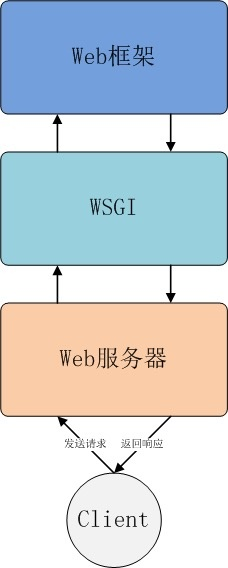

## 服务器，web框架，wsgi，ngix关系疏理

用python开发服务器，小打小闹的，花些时间将一些东西疏理一下

### 各组件作用

#### 服务器、web框架和wsgi关系图

#### web框架/应用服务器
+ 主要用于方便开发人员开发服务器应用程序。HTTP请求的动态数据，由web框架提供
+ Python常见的web框架有：Flask，Dianjo，Tornado等（Tornado同时也实现了WSGI容器功能）

#### web服务器
+ nginx等，理论上说web服务器只处理http协议，处理静态的网页内容，而动态的内容通过WSGI接口，由web框架、应用服务器处理。处理结果经由WSGI接口再给web服务器
+ 好一点儿的web服务还会有负载均衡等其他功能
+ 常见的web服务器有nginx，apache等

#### WSGI
+ wsgi不是独立的服务器或者什么中间件，只是一种接口的规范，仅用于python，定义了web服务器和应用服务器之间的接口规范。
+ 因为PEP0333中指出需要一个东西，来处理web服务器和应用服务器之间的关系，于是出现了WSGI !^_^
+ WSIG 应用服务器/web框架端，需要满足：有两个参数的callable对象，这个对象必须是可多次调用的即可
+ `app = flask.Flask()`,app其实就是实现了`__call__`接口的一个对象实体

